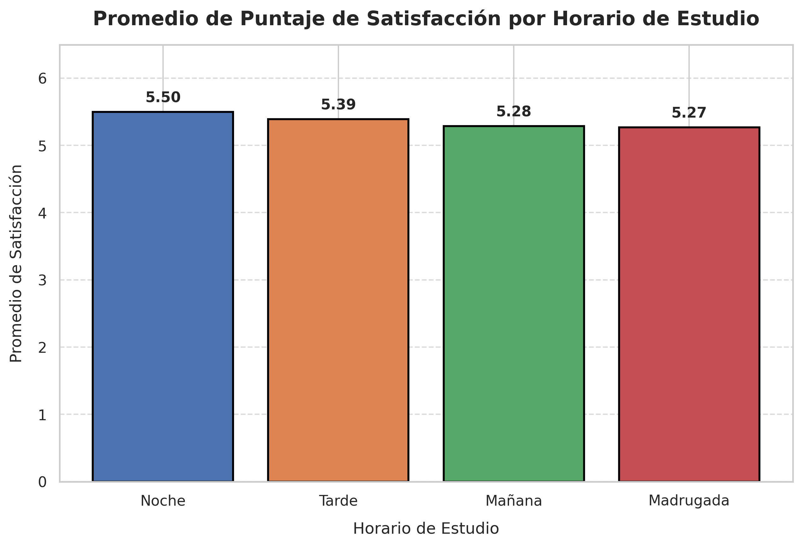
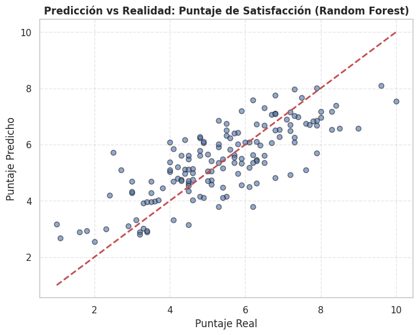
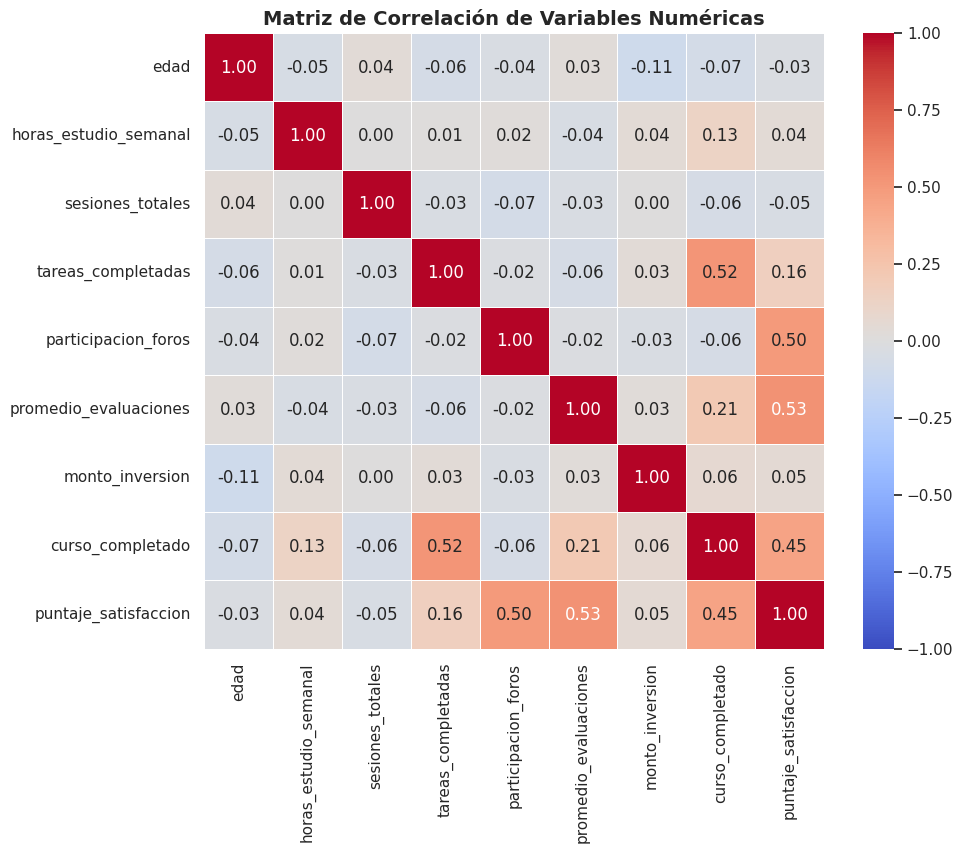
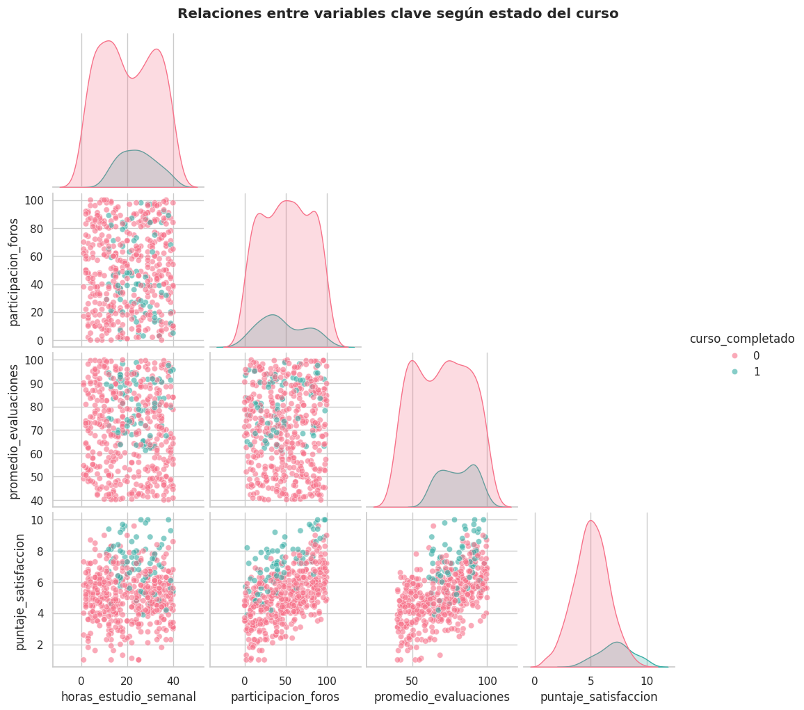
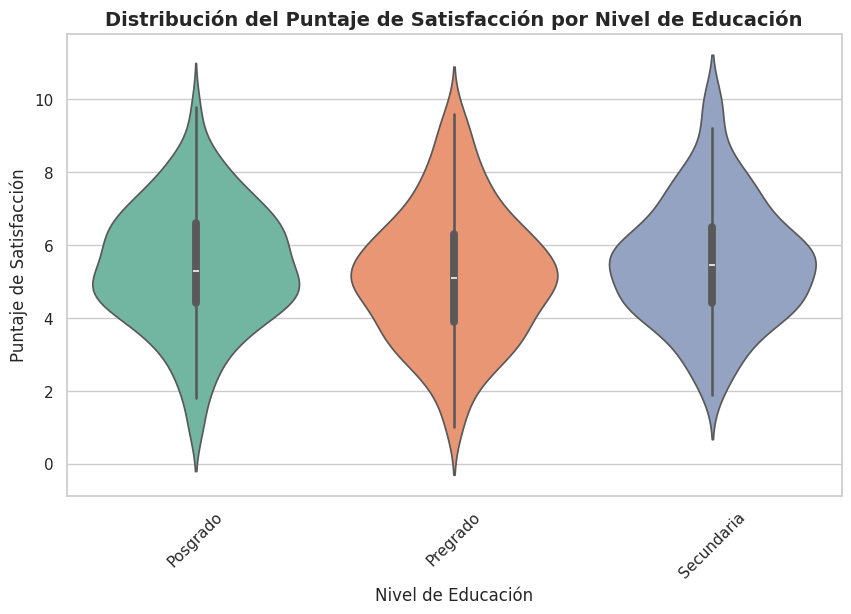

# edutech-data-science-model
Prueba final Bootcamp Data Science

# 🎓 EduTech Analytics: Sistema Predictivo de Rendimiento y Satisfacción Estudiantil

Proyecto integral de Ciencia de Datos y Big Data desarrollado para analizar el comportamiento académico de 500 estudiantes, implementando un ciclo analítico completo que abarca desde la exploración de datos y visualización avanzada hasta la construcción de modelos predictivos y procesamiento distribuido con Apache Spark.

---

## 🚀 Descripción del Proyecto
EduTech Analytics, una plataforma de educación en línea, necesitaba un sistema analítico capaz de anticipar el éxito académico de sus alumnos y estimar su puntaje de satisfacción final. Este repositorio contiene el desarrollo técnico completo para resolver este desafío de negocio mediante Machine Learning e ingeniería de datos.

---

## 📊 Visualizaciones y Hallazgos Gráficos

### 1. Satisfacción según Horario de Estudio
*Gráfico de barras personalizado que muestra el promedio de satisfacción por franja horaria, incorporando anotaciones de valores exactos y diseño optimizado.*

<!-- Reemplaza 'satisfaccion_horario.png' por la ruta de tu imagen si está en una carpeta -->


### 2. Desempeño del Modelo de Regresión (Predicciones vs. Realidad)
*Gráfico de dispersión del modelo Random Forest Regressor para estimar el puntaje de satisfacción del estudiante.*

<!-- Puedes subir una captura del gráfico de dispersión como 'modelo_regresion.png' -->


---

## 🛠️ Stack Tecnológico y Librerías
* **Lenguaje:** Python 3.10+
* **Manipulación y Análisis:** Pandas, NumPy
* **Visualización:** Matplotlib, Seaborn
* **Machine Learning:** Scikit-Learn (Random Forest, Logistic Regression, Ridge, GridSearchCV)
* **Balanceo de Datos:** Imbalanced-Learn (SMOTE)
* **Big Data & Distribuido:** Apache Spark (PySpark, MLlib)
* **Inferencia Estadística:** SciPy

---

## 🔍 Fases del Desarrollo

### 📊 EDA y Visualización Avanzada
* **Validación e Integridad:** Análisis sistemático de los 500 registros para control de nulos, tipos de datos y detección de patrones univariados y multivariados.
* **Correlación Numérica:** Generación de una matriz de correlación visualizada mediante un mapa de calor (*heatmap*) para identificar dependencias lineales entre variables clave como horas de estudio, participación y evaluaciones.
* **Patrones Estudiantiles (Pairplots & Violinplots):** Visualización de la distribución del puntaje de satisfacción segmentado por nivel educacional y clústeres de rendimiento, destacando los factores diferenciales entre los alumnos que completan y los que abandonan el curso.

---
**Visualizaciones del Análisis Exploratorio:**
| Matriz de Correlación (Heatmap) | Relaciones Multivariadas (Pairplot) | Distribución de Satisfacción (Violinplot) |
| :---: | :---: | :---: |
|  |  |  |
---

### ⚙️ Feature Engineering y Preparación
* Creación de variables clave: `tasa_completitud` y `estudiante_activo`.
* Codificación con `LabelEncoder` y `OneHotEncoder`, junto con estandarización (`StandardScaler`).
* Aplicación de **SMOTE** exclusivamente en el set de entrenamiento (70%) para corregir el desbalanceo de clases sin provocar fugas de datos (*data leakage*).

### 🤖 Modelado Predictivo
* **Clasificación (Curso Completado):** Optimización con `GridSearchCV` (cv=5) comparando Regresión Logística y **Random Forest Classifier** (logrando un ROC-AUC sobresaliente).
* **Regresión (Satisfacción):** Comparación entre Ridge Regression y **Random Forest Regressor**, identificando el `promedio_evaluaciones` y la `participacion_foros` como las variables de mayor impacto predictivo.

### ⚡ Procesamiento Distribuido (Apache Spark MLlib)
* Pipeline en PySpark con `StringIndexer` y `VectorAssembler`.
* Entrenamiento de modelos escalables evaluados con métricas de Big Data (`BinaryClassificationEvaluator` y `MulticlassClassificationEvaluator`).

### 📈 Inferencia Estadística
* Cálculo de intervalos de confianza al 95% para la media de satisfacción.
* Pruebas de hipótesis (T-test) demostrando estadísticamente la brecha de satisfacción entre estudiantes que completan el curso y quienes no ($p < 0.05$).

---

## 📂 Estructura del Repositorio
```text
├── assets/                                           # Carpeta de imágenes y gráficos
│   ├── satisfaccion_horario.png                      # Gráfico de barras de satisfacción por horario
│   ├── modelo_regresion.png                          # Gráfico de dispersión del modelo de regresión
│   ├── heatmap_correlacion.png                       # Matriz de correlación (Heatmap)
│   ├── pairplot_estudiantes.png                      # Relaciones multivariadas (Pairplot)
│   └── violin_satisfaccion.png                       # Distribución de satisfacción (Violinplot)
├── 02. Material de apoyo - Estudiantes_edutech.csv   # Dataset base
├── Prueba_Fundamentos_de_ciencia_de_datos.ipynb      # Código fuente completo (EDA, ML y Spark)
└── README.md                                         # Documentación del proyecto
